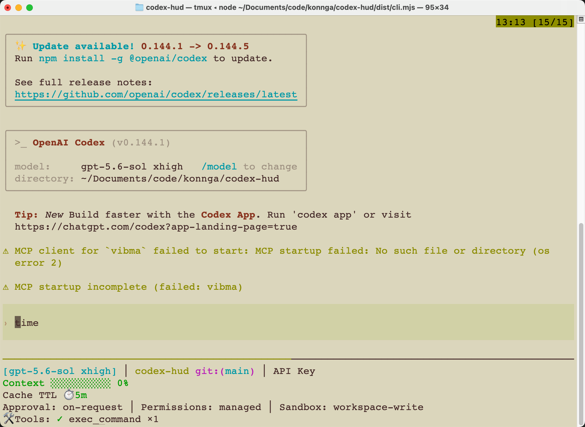

# Codex HUD

> 🌐 English | [中文文档](./README.zh.md)

Codex HUD is a persistent heads-up display for OpenAI Codex CLI. It keeps the official Codex binary unchanged, runs a dedicated terminal pane below the Codex input area, and incrementally reads local rollout JSONL telemetry. In cmux it uses a native split so Codex keeps native scrolling and copying; tmux remains the compatibility backend elsewhere.

## Full display preview

With the Full preset and active session telemetry, the HUD expands to show identity, context and quota usage, environment policy, live activity, and session timing:

```text
[gpt-5.5 high] │ codex-hud +shared git:(main* ↑1) │ ChatGPT pro (builder)
Context ██████░░░░ 59% │ Usage 5h: ███░░░░░░░ 25% (resets in 1h 30m) │ 1w: ████████░░ 82% (resets in 4d) │ $12.50
Cache TTL ⏱️ 5m
Approval: on-request │ Permissions: workspace-write │ Sandbox: workspace-write
🛠️ Tools: ◐ exec_command: pnpm test │ ✓ view_image ×1
🧩 ✓ Skills (2): openai-docs, plugin-creator
🔌 ✓ MCPs (1): github
🤖 ◐ explorer: Inspect protocol (2m)
📋 ▸ Render HUD (1/3)
↕ Turns: 3 · click HUD and press n
⏱️ 1h │ Compactions: 1
```

Example terminal view (tmux):



Rows without available telemetry are omitted automatically. When there is no active plan, the task row can instead show the durable goal.

Highlights:

- Model, provider, reasoning effort, project, and Git status
- Official Codex context-window calculation and token breakdown
- Primary, secondary, spend-control, reset-time, and credit usage data
- Live tools, skills, MCP servers, subagents, plan items, and durable goals
- Compact/expanded layouts, Full/Essential/Minimal presets, and English/Chinese labels
- Standard Codex plugin skills for setup, selective live configuration, and diagnostics
- Reversible launchers and an optional managed `codex` shim
- Prompt-cache countdown, output speed, session title/auth, Git file stats, and external usage snapshots
- Event-driven refresh and launch-scoped isolation for concurrent sessions in the same directory
- Content-fitted cmux/tmux pane height with no reserved blank rows
- Terminal-native conversation navigator for browsing and searching user turns inside the HUD pane
- Fail-open startup: HUD backend failures fall back to untouched official Codex execution
- Cached collectors and a bounded renderer heap for lower idle resource usage

See the audited [feature and telemetry support matrix](./docs/claude-hud-parity.md) for implementation coverage and the exact fallback used when Codex has no equivalent telemetry.

## Requirements

- Node.js 20 or newer
- A working official OpenAI Codex CLI installation
- cmux 0.64 or newer for native scrolling/copying, or tmux as a compatibility backend
- pnpm 10 when building from source

Inside cmux, no tmux installation is required. Outside cmux, install tmux with `brew install tmux` on macOS, `sudo apt install tmux` on Debian/Ubuntu, or the equivalent command for your platform. If no usable backend is available, Codex HUD safely runs official Codex without the HUD.

### Windows support

Native Windows shells are not currently supported for the full HUD. PowerShell, Command Prompt, and native Windows Terminal sessions do not provide a supported cmux/tmux backend, and the managed installer currently creates POSIX shell launchers rather than `.cmd` or PowerShell wrappers. Codex still starts safely, but without the HUD.

WSL2 is supported as a Linux environment. Install Node.js, Codex CLI, tmux, and Codex HUD inside the same WSL distribution:

```bash
sudo apt update
sudo apt install tmux
tmux -V
```

Do not mix a Windows Codex executable with WSL tmux or WSL launchers. Git Bash and MSYS2 are not tested or supported.

## Recommended plugin installation

Install the plugin using Codex CLI's marketplace commands:

```bash
codex plugin marketplace add konnga/codex-hud
codex plugin add codex-hud@codex-hud
```

`konnga/codex-hud` is GitHub shorthand for `https://github.com/konnga/codex-hud.git`. The first command fetches and registers the marketplace snapshot; it does not install the plugin. The second command installs plugin `codex-hud` from marketplace `codex-hud`.

Verify discovery with:

```bash
codex plugin marketplace list --json
codex plugin list --marketplace codex-hud --available --json
```

Start a new Codex session and run:

```text
$codex-hud:setup
```

You can also open `/skills` and select the Codex HUD setup Skill. Setup installs the managed launchers, starts first-time configuration from Full, and guides you through the visible fields. Then restart Codex:

> **The current Codex session will not gain a HUD immediately.** Setup installs launchers and writes configuration, but it cannot inject a cmux/tmux pane into an already-running Codex TUI. Exit the current session and start a new `codex` or `codex-hud` process.

```bash
hash -r
codex
```

`hash -r` only refreshes command-path caching in the shell; it does not reload an active Codex process. cmux users do not need tmux; other terminals need tmux for the compatibility backend.

In short: add the marketplace, install the plugin, run the setup Skill, and restart Codex.

> Installation reads the committed GitHub default branch, not an uncommitted local worktree. Maintainers must push `.agents/plugins/marketplace.json`, `plugins/codex-hud/`, and the built plugin runtime before users can install a new release.

To migrate from the former `personal` marketplace name:

```bash
codex plugin remove codex-hud@personal
codex plugin marketplace remove personal
codex plugin marketplace add konnga/codex-hud
codex plugin add codex-hud@codex-hud
```

### Plugin Skills

The plugin provides three Skills, available by typing their names or selecting them from `/skills`:

- `$codex-hud:setup` installs or upgrades the managed launchers and starts initial display configuration.
- `$codex-hud:configure` opens the visible-element selector and preserves advanced overrides.
- `$codex-hud:doctor` checks the launcher, backend, configuration, plugin, and active session.

The underlying `codex-hud configure` CLI provides the same interactive selector plus deterministic `--enable` and `--disable` updates.

The HUD language defaults to English and does not automatically follow the README language or the system locale. Set it explicitly during setup, or change it later with `codex-hud configure`:

```bash
codex-hud setup --language zh-Hans  # Simplified Chinese
codex-hud setup --language zh-Hant  # Traditional Chinese
```

### Upgrade an existing installation

Codex currently provides `marketplace upgrade` but no separate `plugin upgrade` command. Refresh the marketplace snapshot, reinstall the plugin, then start a new Codex session and rerun the setup Skill:

```bash
codex plugin marketplace upgrade codex-hud
codex plugin remove codex-hud@codex-hud
codex plugin add codex-hud@codex-hud
```

Exit the current Codex session, start `codex` again, and run:

```text
$codex-hud:setup
```

After setup completes, exit and start Codex once more so the refreshed launcher creates the HUD from the new runtime. Existing `${CODEX_HOME:-~/.codex}/codex-hud/config.json` settings are preserved unless a preset is explicitly selected. If the shell still resolves an older launcher, run `hash -r` before starting Codex.

## Install from source

```bash
pnpm install
pnpm build
node dist/cli.mjs setup --codex-shim
hash -r
codex
```

`setup` installs the managed launchers and opens a Full-based visible-element selection panel with a live preview. If `~/.local/bin` is not already available, add it to your shell path:

```bash
export PATH="$HOME/.local/bin:$PATH"
```

The managed launchers use a private runtime copy in `${CODEX_HOME:-~/.codex}/codex-hud/runtime`. They do not reference the versioned Codex plugin cache directly, so marketplace upgrades and cache cleanup cannot leave `codex`, `codex-hud`, or `codex-hud-render` pointing at deleted files.

Use `node dist/cli.mjs setup` without `--codex-shim` if you do not want to replace the `codex` command, then start sessions with `codex-hud`. Existing configuration is preserved unless you explicitly select a preset.

The managed shim transparently passes non-interactive commands such as `codex plugin`, `exec`, `login`, `mcp`, `completion`, and `--version` to the official binary; only interactive TUI sessions receive a HUD pane.

The HUD is an optional decoration layer. If the selected backend or HUD startup fails, Codex HUD runs the official Codex binary directly with the same arguments and propagates its exit code. The pane starts at five rows and then fits the rendered content up to the configured maximum height.

## Daily usage

With the optional shim installed, use Codex normally:

```bash
codex
codex --model gpt-5.5
codex -C /path/to/project
codex resume --last
```

Without the shim:

```bash
codex-hud
codex-hud -- --model gpt-5.5
codex-hud --backend cmux
codex-hud --backend tmux
```

Temporarily bypass the HUD or inspect a single rendered frame:

```bash
codex --no-hud
codex-hud render --once --cwd "$PWD" --no-color
```

### Conversation navigator

When the HUD shows a `Turns` line, click the HUD pane and press `n` to expand it into the conversation navigator. The navigator reads the current Codex rollout and lists only real user submissions; injected environment or developer context is excluded.

- `j` / `k` or arrow keys: move between user turns
- `Enter` or right arrow: open the selected turn
- `/`: search user and assistant text
- `j` / `k`, Page Up, and Page Down: scroll an opened turn
- `Esc`: return to the turn list, then close the navigator
- `q`: close the navigator immediately

Closing the navigator restores the compact HUD height and returns focus to the Codex pane. It does not control or reposition Codex's own TUI scrollback.

See [Conversation navigator](./docs/conversation-navigator.md) for the data model, privacy behavior, backend details, and current limitations.

`--detach` is intended mainly for automation and smoke tests; it starts the session in the background without attaching the current terminal.

## Display configuration

Run the interactive selection panel at any time:

```bash
codex-hud configure
```

Apply a preset or deterministic changes:

```bash
codex-hud configure --preset full --yes
codex-hud configure --status --json
codex-hud configure --enable tools,skills,agents --disable memory,speed --yes
```

Selectable names:

| Name            | Display content                            |
| --------------- | ------------------------------------------ |
| `git`           | Git branch and working-tree status         |
| `usage`         | Usage windows, reset times, and credits    |
| `promptCache`   | Prompt-cache countdown                     |
| `tools`         | Tool-call activity                         |
| `skills`        | Skill activity                             |
| `mcp`           | MCP server activity                        |
| `agents`        | Sub-agent status                           |
| `todos`         | Plan and task progress                     |
| `goal`          | Durable goal                               |
| `turns`         | Conversation turn count and navigator hint |
| `configCounts`  | Config, rule, Skill, and MCP counts        |
| `auth`          | Authentication method                      |
| `memory`        | Approximate system memory                  |
| `duration`      | Session duration                           |
| `speed`         | Previous response output speed             |
| `sessionName`   | Explicitly named session title             |
| `sessionTokens` | Cumulative session tokens                  |
| `compactions`   | Context compaction count                   |

Saved changes are reloaded by sessions that already have a HUD pane. Hot reload cannot add a HUD pane to an existing Codex process that was started without the Codex HUD launcher.

Configuration lives at `${CODEX_HOME:-~/.codex}/codex-hud/config.json`.

Backend selection defaults to `auto`: native cmux split when an interactive cmux surface and healthy control socket are available; the user's existing tmux session when already inside tmux; otherwise a private tmux compatibility session. A broken cmux socket falls back to native Codex without a HUD instead of silently wrapping Codex in tmux. Use `--backend cmux|tmux|none` to override the automatic choice.

The cmux backend leaves Codex in the original surface and creates only the HUD as a new unfocused bottom split, preserving native scrollback, selection, and copying. Its initial height fits the rendered content; dragging the divider transfers height control to the user for the rest of that HUD session, so later refreshes do not resize it back. The tmux backend cannot provide identical terminal-native semantics. Inside a user-owned tmux session, Codex HUD does not change that session's tmux options.

Codex HUD uses the cmux 0.64 directional pane-resize API (`--pane`, `-U` / `-D`, and `--amount`). Older Codex HUD builds that still call tmux-style `-t ... -y ...` arguments can fail open with a `Pane has no adjacent border in direction right` message; rebuild or upgrade Codex HUD before starting a new session.

## Diagnostics

```bash
codex-hud doctor
codex-hud doctor --json --cwd "$PWD"
codex-hud render --once --cwd "$PWD" --no-color
```

Doctor checks the Codex executable, selected backend, configuration, plugin installation, and active session discovery. The one-shot renderer helps distinguish session discovery problems from terminal pane problems.

## Uninstall

Preview or remove only the launchers recorded in the managed installation state:

```bash
codex-hud uninstall --dry-run
codex-hud uninstall
```

Uninstall removes only launchers recorded in the managed installation state. It does not delete the HUD configuration or official Codex data.

If installed through the Codex plugin marketplace, remove the managed launchers first and then remove the plugin and marketplace:

```bash
codex-hud uninstall
codex plugin remove codex-hud@codex-hud
codex plugin marketplace remove codex-hud
```

## Verification

```bash
pnpm release:check
pnpm lint --fix
pnpm typecheck
pnpm test
pnpm build
node dist/render-cli.mjs --once --cwd "$PWD" --no-color
node dist/cli.mjs doctor --json
```

Maintainers should follow [Versioning and releases](./docs/releasing.md) when preparing a new SemVer, plugin cachebuster, changelog section, and Git tag.

See [README.zh.md](./README.zh.md) for complete Chinese usage and architecture notes. Inside Codex, use `$codex-hud:setup`, `$codex-hud:configure`, or `$codex-hud:doctor`; all three are also available through `/skills`.

Inside cmux, Codex HUD uses the cmux control socket to create, resize, and close only the HUD surface. Outside an existing tmux client, the compatibility backend creates a private per-launch tmux socket and does not load the user's tmux configuration. Inside tmux, it only creates and later removes the HUD pane without changing user-owned options.

## License

Codex HUD is released under the [MIT License](./LICENSE). See [NOTICE](./NOTICE) for attribution of adapted work.
