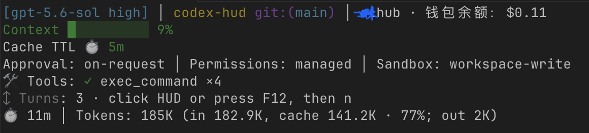

# Codex HUD

[](https://github.com/konnga/codex-hud/releases/latest)
[](https://github.com/konnga/codex-hud/actions/workflows/ci.yml)
[](https://nodejs.org/)
[](./LICENSE)

> 🌐 English | [中文文档](./README.zh.md)

Keep context, quota, Git status, tools, agents, tasks, and session details visible in a persistent pane below Codex. The official Codex binary remains untouched.

## Full display preview

With the Full preset, available session telemetry expands into model and project identity, context, tokens, quota and cache status, tools, Skills, MCP servers, agents, plans, goals, turns, images, environment policy, and session totals:

```text
[gpt-5.6-sol high] │ codex-hud git:(main*) M2 A1 ?1 │ ChatGPT pro
Context ██████░░░░ ~59% │ 5h: ███░░░░░░░ 25% (at Jul 16, 18:30) │ 1w: ████████░░ 82% (at Jul 20, 17:00)
Cache estimate ~⏱️ 5m
Approval: on-request │ Permissions: managed │ Sandbox: workspace-write
🛠️ Tools: ◐ exec_command: pnpm test │ ✓ view_image ×1
🧩 ✓ Skills (2): openai-docs, pdf
🔌 ✓ MCPs (2): github, browser
🤖 ◐ explorer: Inspect protocol (2m)
📋 ▸ Render HUD (1/3)
↕ Turns: 6 · click HUD or press F12, then n
🖼 Images: 2 · hud-preview.png · i gallery
⏱️ 1h │ Tokens: 55k (in 50k, cache 30k · 60%; out 5k) │ Compactions: 2
```

Conversation navigator:

```text
01a02d22-6aa1-7fb0-ba1c-89cb0b5d754d [⧉  y] · Conversation navigator · 3 turns
#01 13:40 Add a copy-ID shortcut to the conversation navigator
#02 13:47 Update the local Codex HUD so I can test it
> #03 14:23 Refresh the Full preset example in the README
j/k move · Enter open · / search · y copy ID · q/Esc close
```

Actual terminal view:


## What is Codex HUD?

Codex HUD is a persistent terminal information panel for OpenAI Codex CLI. It brings context, quota, Git status, tool calls, agents, tasks, and session details together below Codex, so you can understand the active session without leaving your workflow.

It does not replace or modify the official Codex binary. Instead, it reads local Codex rollout data and creates a dedicated HUD pane. It uses a native split in cmux and a tmux compatibility backend elsewhere; if no backend works or HUD startup fails, Codex still runs normally with the original arguments.

Only rows with available telemetry are rendered; unavailable data stays out of the way.

| Category          | Examples                                                                                                             |
| ----------------- | -------------------------------------------------------------------------------------------------------------------- |
| Model and project | Model, reasoning effort, project paths, Git branch, dirty state, and file status                                     |
| Context and quota | Context usage, token/cache breakdown, quota windows, server-provided reset dates in local time, and provider credits |
| Live activity     | Tools, Skills, MCP servers, subagents, plans, goals, turns, and session images                                       |
| Environment       | Authentication, approval policy, sandbox, and permission profile                                                     |
| Session           | Duration, cumulative token totals, prompt-cache estimate, and compaction count                                       |

See the audited [feature and telemetry support matrix](./docs/claude-hud-parity.md) for exact data sources and fallback behavior.

## Quick start

Prepare the environment, then choose one installation path below. Both paths install the same managed runtime and preserve `${CODEX_HOME:-~/.codex}/codex-hud/config.json`.

```text
prepare cmux/tmux → install the plugin → run setup → restart Codex
```

### 1. Prepare the environment

You need:

- Node.js 20 or newer
- A working official OpenAI Codex CLI installation
- cmux 0.64 or newer, or tmux

tmux is not required inside cmux. Other terminals use tmux as the compatibility backend:

```bash
# macOS
brew install tmux

# Debian / Ubuntu
sudo apt install tmux
```

`sqlite3` is optional. It enables session titles, verifies the endpoint actually used by each session, and recovers account-wide limit events from Codex logs. ChatGPT-authenticated sessions can still show rollout-provided subscription limits when the endpoint is unavailable; API-key and custom-provider sessions stay conservative until their endpoint can be verified.

`chafa` is optional and enables inline image previews in the terminal. Install it on macOS with `brew install chafa`. Without it, the image gallery still lists image paths and can open files with the system image viewer.

### 2. Choose an installation path

#### Option A: Install and update through Codex

In a Codex session, send the project URL and ask Codex to install and configure it:

```text
Install Codex HUD from https://github.com/konnga/codex-hud. Register the repository, install the plugin, run setup, preserve my existing configuration, and verify the result with doctor.
```

Codex will register the repository as a marketplace, install the plugin, run the setup Skill, preserve the existing configuration, and verify the managed runtime.

For later updates, send another request in Codex:

```text
Update Codex HUD from https://github.com/konnga/codex-hud to the latest version. Preserve my existing configuration, reinstall the plugin if needed, and run doctor when finished.
```

#### Option B: Run the CLI manually

For a first-time install, run:

```bash
codex plugin marketplace add konnga/codex-hud
codex plugin add codex-hud@codex-hud
codex-hud setup --codex-shim --yes
codex-hud doctor
```

For a later update, run:

```bash
codex plugin marketplace upgrade codex-hud
codex plugin remove codex-hud@codex-hud
codex plugin add codex-hud@codex-hud
codex-hud setup --codex-shim --yes
codex-hud doctor
```

If the marketplace source conflicts or no plugin appears after refreshing, rebuild the registration:

```bash
codex plugin remove codex-hud@codex-hud
codex plugin marketplace remove codex-hud
codex plugin marketplace add https://github.com/konnga/codex-hud.git
codex plugin add codex-hud@codex-hud
```

### 3. Restart Codex

After installation or an update, exit the current Codex session and start a new one. If your shell still resolves an older launcher, run `hash -r` before starting `codex` again. The running session cannot load newly installed Skills or receive a new HUD pane; setup cannot add a pane to an already running Codex TUI. The update is complete when the new session opens with a HUD pane below Codex.

## Everyday commands

| Where        | Command or key                                    | Purpose                                                        |
| ------------ | ------------------------------------------------- | -------------------------------------------------------------- |
| Inside Codex | `$codex-hud:configure`                            | Choose visible fields with a live preview                      |
| Inside Codex | `$codex-hud:doctor`                               | Check the launcher, backend, configuration, and active session |
| HUD pane     | `n`                                               | Open the conversation navigator                                |
| HUD pane     | `i`                                               | Open the current session's image gallery                       |
| Terminal     | `codex`                                           | Start interactive Codex with the HUD                           |
| Terminal     | `codex --no-hud`                                  | Temporarily bypass the HUD and run official Codex directly     |
| Terminal     | `codex-hud render --once --cwd "$PWD" --no-color` | Print one plain-text HUD frame                                 |
| Terminal     | `codex-hud hud-version`                           | Print the running HUD version                                  |

Non-interactive commands such as `codex exec`, `plugin`, `login`, `mcp`, `completion`, `--help`, and `--version` pass directly to the official Codex executable.

## Features

### Configure the display

Open the interactive selector at any time:

```bash
codex-hud configure
```

Or apply a preset directly:

| Preset         | Best for                                                                    |
| -------------- | --------------------------------------------------------------------------- |
| `full`         | First-time use and complete day-to-day information                          |
| `essential`    | Project, context, quota, and primary activity only                          |
| `minimal`      | A small information set for narrow terminals                                |
| `presentation` | Screen sharing without transcript, auth-user, image, or tool-target details |

```bash
codex-hud configure --preset full --yes
codex-hud configure --preset essential --yes
codex-hud configure --preset minimal --yes
codex-hud configure --preset presentation --yes
```

Enable or disable exact fields:

```bash
codex-hud configure --enable tools,skills,agents --disable memory,speed --yes
codex-hud configure --status --json
```

The HUD defaults to English and does not automatically follow the README or system language:

```bash
codex-hud configure --language zh-Hans
```

Configuration is stored at `${CODEX_HOME:-~/.codex}/codex-hud/config.json`. Sessions that already have a HUD pane reload saved changes automatically. A Codex process started without the Codex HUD launcher still needs to be restarted.

### Relay balance queries

Codex HUD supports CC Switch's common balance and usage response shapes plus dedicated New API and Sub2API templates. Relay queries are disabled by default. First-time interactive setup asks whether to enable the general query; non-interactive setup requires `--relay-usage`. When enabled and a new session reaches a third-party relay, the HUD queries that relay with the current API key. ChatGPT and OpenAI official origins are always excluded. Queries run only while `auth` is visible. The balance appears beside the API-key provider name, for example `anyrouter · $12.50`, rather than on a separate usage line.



No configuration is required for a relay that implements the general protocol. To disable automatic balance queries, set `"externalUsageQueries": []`. Use explicit entries only for a dedicated query key or a New API/Sub2API management endpoint:

```json
{
  "display": {
    "externalUsageQueries": [
      {
        "enabled": true,
        "origin": "https://new-api.example.com",
        "template": "newApi",
        "apiKeyEnv": "",
        "accessTokenEnv": "RELAY_ACCESS_TOKEN",
        "userIdEnv": "RELAY_USER_ID",
        "refreshMs": 300000,
        "quotaPerCredit": 500000
      },
      {
        "enabled": true,
        "origin": "https://sub2.example.com",
        "template": "sub2Api",
        "apiKeyEnv": "",
        "accessTokenEnv": "SUB2_JWT",
        "userIdEnv": "",
        "refreshMs": 300000,
        "quotaPerCredit": 500000
      }
    ]
  }
}
```

The default `general` template follows CC Switch's common query shapes. It first requests `GET /user/balance` and reads `balance`; if that does not return JSON usage data, it also tries the active API base URL's `/usage` endpoint and reads `remaining` (or `balance`), `unit`, and `planName`. Both requests use a Bearer API key and stay on the active relay origin. Credential-bearing queries require HTTPS, except for explicit loopback development endpoints on `localhost`, `127.0.0.1`, or `[::1]`. The query reuses the current `OPENAI_API_KEY`; after an explicit entry sets `apiKeyEnv`, only that dedicated query key is used, and a missing variable never falls back to the inference key. These endpoints are common conventions, not an industry standard, so unsupported relays simply show no balance.

Codex-shaped `codex.rate_limits` events returned by third-party relays are ignored because they may describe a shared upstream pool rather than the user's OpenAI subscription. Native usage windows are trusted only for official ChatGPT and OpenAI API endpoints. When Codex provides `reset_at`/`resets_at`, HUD displays that server-provided timestamp as a local date and time; if no reset timestamp is available, it does not invent one.

For New API, use its system access token and user ID, not the inference `sk-` key. For Sub2API, use the panel login JWT. New API quota units default to 500,000 per displayed dollar; change `quotaPerCredit` for deployments with a different conversion. Cache entries are isolated by the actual credential and user. Queries refresh in the background without blocking HUD rendering. Requests time out after three seconds and response bodies are capped at 64 KiB; transient failures preserve the last successful value for at most 15 minutes after a failed refresh.

<details>
<summary><strong>All configurable fields and environment variables</strong></summary>

Names accepted by `--enable` and `--disable`:

| Name                            | Content                                                          |
| ------------------------------- | ---------------------------------------------------------------- |
| `git`                           | Git branch and working-tree status                               |
| `usage`                         | Usage windows, server-provided local reset dates, and credits    |
| `promptCache`                   | Configured prompt-cache reuse-window estimate                    |
| `tools` / `skills` / `mcp`      | Tool, Skill, and MCP activity                                    |
| `agents`                        | Subagent status                                                  |
| `todos` / `goal`                | Plans, tasks, and durable goals                                  |
| `turns`                         | Conversation count and navigator hint                            |
| `images`                        | Session image count and gallery entry point                      |
| `configCounts`                  | Config, rule, Skill, and MCP counts                              |
| `auth`                          | ChatGPT plan or the actual endpoint host for the current session |
| `memory`                        | Approximate system memory                                        |
| `duration` / `speed`            | Session duration and output speed                                |
| `sessionName` / `sessionTokens` | Session title and cumulative tokens                              |
| `compactions`                   | Context compaction count                                         |

Common environment variables:

| Variable              | Purpose                                    |
| --------------------- | ------------------------------------------ |
| `CODEX_HOME`          | Codex data and configuration directory     |
| `CODEX_HUD_CONFIG`    | Override the HUD configuration path        |
| `CODEX_HUD_CODEX_BIN` | Point to the real Codex executable         |
| `CODEX_HUD_BIN_DIR`   | Launcher directory, default `~/.local/bin` |
| `CODEX_HUD_HEIGHT`    | Maximum HUD pane height, default 30        |
| `NO_COLOR`            | Disable ANSI colors                        |

</details>

<details>
<summary><strong>Git status markers</strong></summary>

For example, `git:(main* ↑1) M2 A1 ?1` means branch `main` has uncommitted changes, is one commit ahead of upstream, and contains two modified files, one staged addition, and one untracked file.

| Marker | Meaning             |
| ------ | ------------------- |
| `M`    | Modified            |
| `A`    | Added (staged)      |
| `D`    | Deleted             |
| `R`    | Renamed             |
| `C`    | Copied              |
| `T`    | Type changed        |
| `?`    | Untracked           |
| `!`    | Conflict (unmerged) |

</details>

### Conversation navigator

When the HUD shows a `Turns` row, click the HUD pane and press `n`:

- `j` / `k` or arrow keys: select the previous or next turn
- `Enter` or right arrow: open the full turn
- `/`: search user and assistant text
- `y`: copy the full Codex session ID
- Page Up / Page Down: scroll the open turn
- `Esc`: return to the list, then close
- `q`: close immediately

The navigator lists real user submissions only; injected environment context and developer instructions are excluded. See [Conversation navigator](./docs/conversation-navigator.md) for its data model, privacy behavior, and limitations.

### Image gallery

When the current Codex session references images from `view_image` or image-generation tools, the HUD adds an `Images` row. Click the HUD pane to focus it, then press `i` to open the gallery. The gallery is scoped to the currently bound Codex session; images from another session in the same project are not included.

<div align="center">
<figure>

<figcaption>The HUD shows the image count and the <code>i gallery</code> entry point.</figcaption>
</figure>
<figure>

<figcaption>The gallery lists images from the current Codex session.</figcaption>
</figure>
<figure>

<figcaption>Without <code>chafa</code>, preview mode shows metadata and keeps the system-viewer action.</figcaption>
</figure>
</div>

- `j` / `k` or arrow keys: select an image
- `Enter` or right arrow: render an inline terminal preview
- `o`: open the selected file with the system default image viewer
- `y`: copy the selected file path
- `Esc` or `q`: close the gallery or return from the preview

Inline previews use the optional [`chafa`](https://github.com/hpjansson/chafa) command. If it is unavailable, the preview shows the file path and metadata instead. Install it with:

```bash
# macOS
brew install chafa
```

See [Image viewer](./docs/image-viewer.md) for supported image sources, controls, and fallback behavior.

## System support

| System or environment | Support              | Requirements and notes                                                                     |
| --------------------- | -------------------- | ------------------------------------------------------------------------------------------ |
| macOS                 | Supported            | Use cmux 0.64+ or tmux; cmux preserves native scrolling, selection, and copying            |
| Linux                 | Supported            | Requires tmux as the HUD pane backend                                                      |
| WSL2                  | Supported            | Node.js, Codex, tmux, and Codex HUD must be installed in the same Linux distribution       |
| Native Windows        | Full HUD unsupported | PowerShell, Command Prompt, and native Windows Terminal cannot create a supported HUD pane |

Every supported environment requires Node.js 20 or newer and a working official Codex CLI installation. `sqlite3` is optional and adds session titles, actual endpoint detection, and logged limit recovery.

If no usable cmux/tmux environment is available or HUD startup fails, Codex HUD runs official Codex directly. Commands remain available, but no HUD is displayed.

## Troubleshooting

Start with:

```bash
codex-hud doctor
codex-hud render --once --cwd "$PWD" --no-color
codex-hud hud-version
```

Common cases:

| Symptom                                             | Fix                                                       |
| --------------------------------------------------- | --------------------------------------------------------- |
| Setup succeeded, but the current session has no HUD | Exit Codex, run `hash -r`, and start `codex` again        |
| `tmux: not found`                                   | Install tmux; cmux users do not need it                   |
| `Session: not found`                                | Run Codex and doctor with the same real project directory |
| The command still resolves to an old launcher       | Run `hash -r` or open a new terminal                      |
| You want to confirm whether the HUD is involved     | Temporarily use `codex --no-hud`                          |

## Development

Building from source requires pnpm 10:

```bash
pnpm install
pnpm test:coverage
pnpm build
node dist/cli.mjs setup --codex-shim
hash -r
codex
```

The managed runtime is installed at `${CODEX_HOME:-~/.codex}/codex-hud/runtime`, so it does not depend on a plugin cache directory that an upgrade might remove.

## Uninstall

Remove managed launchers first, then optionally remove the plugin and marketplace:

```bash
codex-hud uninstall --dry-run
codex-hud uninstall
codex plugin remove codex-hud@codex-hud
codex plugin marketplace remove codex-hud
```

Uninstall does not delete the HUD configuration, official Codex data, or files that are not managed by Codex HUD.

## Privacy and safety

- By default, the HUD reads local Codex rollout data, configuration metadata, and Git status only. Relay balance queries require an explicit setup choice or configuration entry.
- Explicitly enabled relay balance queries send the configured management credential to the matching session origin only; credentials are read from environment variables and are not persisted by Codex HUD.
- Credential-bearing relay queries require HTTPS, except for loopback-only local development endpoints.
- The persistent HUD does not display user prompts, model response bodies, or tool output bodies. Common credentials in retained tool targets are redacted before rendering.
- Conversation content is displayed only after the user explicitly opens the navigator and remains local.
- The `presentation` preset hides transcript navigation, auth user, image paths, and tool details for screen sharing.
- All rendered text is stripped of terminal control characters.
- Codex HUD does not modify the official Codex binary, and `--no-hud` bypasses it at any time.

Codex HUD is released under the [MIT License](./LICENSE). See [NOTICE](./NOTICE) for attribution of adapted work.

## Friendly links

[linux.do](https://linux.do)
