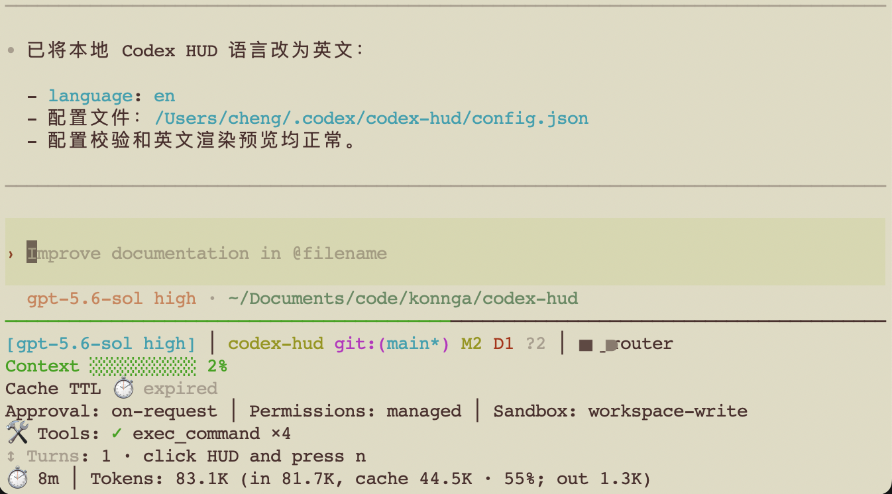

# Codex HUD

> 🌐 [English](./README.md) | 中文文档

在 Codex 输入区下方常驻显示上下文、额度、Git 状态、工具、Agent、任务和会话信息。无需修改官方 Codex 二进制。

## 完整展示效果

Full 预设会根据当前会话的可用数据，展示模型与项目、Context 和额度、实时活动、运行环境以及会话状态：

```text
[gpt-5.5 high] │ codex-hud git:(main* ↑1) M2 A1 ?1 │ ChatGPT pro
上下文 ██████░░░░ 59% │ 5h: ███░░░░░░░ 25% (重置于 1h 30m) │ 1w: ████████░░ 82% (重置于 4d)
🛠️ 工具: ◐ exec_command: pnpm test │ ✓ view_image ×1
🤖 ◐ explorer: 检查协议 (2m)
📋 ▸ 渲染 HUD (1/3)
⏱️ 1h │ Token: 55k (输入 50k，缓存 30k · 60%；输出 5k)
```

终端效果：



## 什么是 Codex HUD？

Codex HUD 是面向 OpenAI Codex CLI 的常驻终端信息面板。它把 Context、额度、Git 状态、工具调用、Agent、任务和会话信息集中显示在 Codex 下方，让你不必离开当前工作流就能了解会话状态。

它不会替换或修改官方 Codex 二进制，而是读取本地 Codex rollout 数据并创建独立 HUD pane。在 cmux 中使用原生 split，其他终端使用 tmux 兼容 backend；如果 backend 不可用或 HUD 启动失败，Codex 仍会按原参数正常运行。

HUD 只展示当前有数据的行，没有遥测数据的内容会自动隐藏。

| 分类           | 示例                                                              |
| -------------- | ----------------------------------------------------------------- |
| 模型与项目     | 模型、reasoning effort、项目路径、Git 分支和文件状态              |
| Context 与额度 | Context 使用率、累计 Token、缓存占比、周额度、reset 时间、credits |
| 实时活动       | 工具调用、Skills、MCP server、子 Agent、计划和持久 Goal           |
| 运行环境       | approval、sandbox、权限和 collaboration mode                      |
| 会话           | 会话标题、持续时间、输出速度、压缩次数和轮次导航                  |

完整遥测来源和支持边界见[功能与遥测支持矩阵](./docs/claude-hud-parity.md)。

## 快速开始

首次安装按第 1–4 项操作；已经安装的用户可以直接跳到第 5 项。

```text
准备 cmux/tmux → 安装插件 → 运行 setup → 重启 Codex
```

### 1. 准备运行环境

需要：

- Node.js 20 或更高版本
- 可以正常运行的官方 OpenAI Codex CLI
- cmux 0.64 或更高版本，或者 tmux

在 cmux 中无需安装 tmux。其他终端需要 tmux 作为兼容 backend：

```bash
# macOS
brew install tmux

# Debian / Ubuntu
sudo apt install tmux
```

`sqlite3` 是可选依赖，用于读取会话标题和会话实际连接的 endpoint。

`chafa` 是可选依赖，用于在终端内联预览图片。macOS 可执行 `brew install chafa` 安装。未安装时，图片画廊仍会显示图片路径，并可以调用系统默认图片查看器打开文件。

### 2. 安装 Codex HUD 插件

在普通终端执行：

```bash
codex plugin marketplace add konnga/codex-hud
codex plugin add codex-hud@codex-hud
```

### 3. 运行首次设置

启动一个新的 Codex 会话，然后输入：

```text
$codex-hud:setup
```

也可以输入 `/skills`，选择 Codex HUD 的 setup Skill。它会安装受管 launcher，并打开带实时预览的显示项选择器。

> setup 无法把 HUD 注入当前已经运行的 Codex TUI。这是终端 pane 的限制，不是安装失败。

### 4. 重启 Codex

setup 完成后退出当前会话，在普通终端执行：

```bash
hash -r
codex
```

新会话下方出现 HUD pane 即表示安装完成。需要检查环境时运行：

```bash
codex-hud doctor
```

### 5. 更新版本

在 Codex 中直接输入：

```text
请帮我把 Codex HUD 更新到最新版，保留现有配置，并在完成后运行 doctor 检查。
```

AI 会刷新 marketplace、重新安装插件、更新受管 runtime，并检查安装状态。更新不会删除 `${CODEX_HOME:-~/.codex}/codex-hud/config.json`。

> 当前会话无法加载刚安装的新 Skill，也无法立即获得新版 HUD pane。更新完成后仍需退出并重新启动 Codex。

<details>
<summary><strong>手动更新命令</strong></summary>

Codex 目前没有单独的 plugin upgrade 命令，因此需要刷新 marketplace 后重新安装插件：

```bash
codex plugin marketplace upgrade codex-hud
codex plugin remove codex-hud@codex-hud
codex plugin add codex-hud@codex-hud
```

随后启动 Codex，运行 `$codex-hud:setup`，完成后再重启一次 Codex。

如果 marketplace 来源冲突或刷新后找不到插件，可以重建注册：

```bash
codex plugin remove codex-hud@codex-hud
codex plugin marketplace remove codex-hud
codex plugin marketplace add https://github.com/konnga/codex-hud.git
codex plugin add codex-hud@codex-hud
```

移除插件或 marketplace 不会删除已有 HUD 配置。

</details>

## 常用操作

| 在哪里   | 命令或按键                                        | 用途                                   |
| -------- | ------------------------------------------------- | -------------------------------------- |
| Codex 内 | `$codex-hud:configure`                            | 选择要显示的字段并实时预览             |
| Codex 内 | `$codex-hud:doctor`                               | 检查 launcher、backend、配置和当前会话 |
| HUD pane | `n`                                               | 打开会话历史导航器                     |
| HUD pane | `i`                                               | 打开当前会话的图片画廊                 |
| 普通终端 | `codex`                                           | 使用 HUD 启动交互式 Codex              |
| 普通终端 | `codex --no-hud`                                  | 临时绕过 HUD，直接运行官方 Codex       |
| 普通终端 | `codex-hud render --once --cwd "$PWD" --no-color` | 查看一次纯文本渲染结果                 |

`codex exec`、`plugin`、`login`、`mcp`、`completion`、`--help` 和 `--version` 等非交互命令会自动直通官方 Codex。

## 配置显示内容

随时打开交互式选择器：

```bash
codex-hud configure
```

也可以直接应用预设：

| 预设        | 适合场景                            |
| ----------- | ----------------------------------- |
| `full`      | 第一次使用，展示日常可用的完整信息  |
| `essential` | 只保留项目、Context、额度和主要活动 |
| `minimal`   | 适合窄终端的最小信息集              |

```bash
codex-hud configure --preset full --yes
codex-hud configure --preset essential --yes
codex-hud configure --preset minimal --yes
```

精确打开或关闭字段：

```bash
codex-hud configure --enable tools,skills,agents --disable memory,speed --yes
codex-hud configure --status --json
```

HUD 默认使用英文，不会自动跟随 README 或系统语言：

```bash
codex-hud configure --language zh-Hans
codex-hud configure --language zh-Hant
```

配置保存在 `${CODEX_HOME:-~/.codex}/codex-hud/config.json`。已经存在 HUD pane 的会话会自动加载保存后的配置；没有通过 Codex HUD launcher 启动的旧会话仍需重启。

### 中转站余额查询

Codex HUD 支持 CC Switch 常见的余额与用量返回格式，以及 New API、Sub2API 专用模板。通用查询默认开启：新会话连接第三方中转站后，HUD 会使用当前 API Key 查询该中转站。ChatGPT 与 OpenAI 官方 origin 始终排除。查询仅在显示 `auth` 时运行；余额显示在 API Key 服务商名称右侧，例如 `anyrouter · $12.50`，不会单独占用 usage 行。

支持通用协议的中转站无需任何配置。若要关闭自动余额查询，请设置 `"externalUsageQueries": []`。只有使用专用查询 Key 或 New API/Sub2API 管理接口时才需要显式配置：

```json
{
  "display": {
    "externalUsageQueries": [
      {
        "enabled": true,
        "origin": "https://new-api.example.com",
        "template": "newApi",
        "apiKeyEnv": "",
        "accessTokenEnv": "RELAY_ACCESS_TOKEN",
        "userIdEnv": "RELAY_USER_ID",
        "refreshMs": 300000,
        "quotaPerCredit": 500000
      },
      {
        "enabled": true,
        "origin": "https://sub2.example.com",
        "template": "sub2Api",
        "apiKeyEnv": "",
        "accessTokenEnv": "SUB2_JWT",
        "userIdEnv": "",
        "refreshMs": 300000,
        "quotaPerCredit": 500000
      }
    ]
  }
}
```

默认的 `general` 模板兼容 CC Switch 的常见查询格式：先请求 `GET /user/balance` 并读取 `balance`；若未返回 JSON 用量数据，再请求当前 API Base URL 下的 `/usage`，读取 `remaining`（或 `balance`）、`unit` 和 `planName`。两次请求都使用 Bearer API Key，且严格限制在当前中转 origin。查询复用当前 `OPENAI_API_KEY`；显式配置时可通过 `apiKeyEnv` 使用专用查询 Key。这些接口只是常见约定，并非所有中转站都支持；不支持时 HUD 静默不显示余额。

第三方中转返回的 Codex 格式 `codex.rate_limits` 事件会被忽略，因为它可能描述共享上游账户池，而不是用户自己的 OpenAI 套餐。原生用量窗口仅信任 ChatGPT 和 OpenAI API 官方端点。

New API 需要系统访问令牌和用户 ID，不是用于推理的 `sk-` Key；Sub2API 使用面板登录 JWT。New API 默认按 500,000 quota 单位显示为 1 美元，可通过 `quotaPerCredit` 适配不同部署。请求三秒超时；短暂失败时继续显示上一次成功结果。

<details>
<summary><strong>全部可配置字段和环境变量</strong></summary>

可用于 `--enable` / `--disable` 的名称：

| 名称                            | 内容                                       |
| ------------------------------- | ------------------------------------------ |
| `git`                           | Git 分支和工作区状态                       |
| `usage`                         | 额度窗口、reset 时间和 credits             |
| `promptCache`                   | Prompt Cache 倒计时                        |
| `tools` / `skills` / `mcp`      | 工具、Skill 和 MCP 活动                    |
| `agents`                        | 子 Agent 状态                              |
| `todos` / `goal`                | 计划、任务和持久 Goal                      |
| `turns`                         | 会话轮次和导航提示                         |
| `configCounts`                  | 配置、规则、Skill 和 MCP 数量              |
| `auth`                          | ChatGPT 套餐或当前会话实际 endpoint 主机名 |
| `memory`                        | 近似系统内存                               |
| `duration` / `speed`            | 会话时长和回复速度                         |
| `sessionName` / `sessionTokens` | 会话标题和累计 Token                       |
| `compactions`                   | Context 压缩次数                           |

常用环境变量：

| 变量                  | 作用                                  |
| --------------------- | ------------------------------------- |
| `CODEX_HOME`          | Codex 数据与配置目录                  |
| `CODEX_HUD_CONFIG`    | 覆盖 HUD 配置路径                     |
| `CODEX_HUD_CODEX_BIN` | 指定真实 Codex 可执行文件             |
| `CODEX_HUD_BIN_DIR`   | launcher 安装目录，默认`~/.local/bin` |
| `CODEX_HUD_HEIGHT`    | HUD pane 最大高度，默认 30            |
| `NO_COLOR`            | 禁用 ANSI 颜色                        |

</details>

<details>
<summary><strong>Git 状态标记</strong></summary>

例如 `git:(main* ↑1) M2 A1 ?1` 表示分支为 `main`、有未提交改动、领先上游 1 个提交，并包含 2 个修改文件、1 个已暂存新增文件和 1 个未跟踪文件。

| 标记 | 含义           |
| ---- | -------------- |
| `M`  | 已修改         |
| `A`  | 新增（已暂存） |
| `D`  | 已删除         |
| `R`  | 重命名         |
| `C`  | 复制           |
| `T`  | 类型变更       |
| `?`  | 未跟踪         |
| `!`  | 冲突（未合并） |

</details>

## 会话历史导航

当 HUD 显示“轮次”行时，点击 HUD pane 并按 `n`：

- `j` / `k` 或方向键：选择上一轮、下一轮
- `Enter` 或右方向键：打开完整轮次
- `/`：搜索用户输入和助手回复
- Page Up / Page Down：滚动当前轮次
- `Esc`：返回列表，再次按下关闭
- `q`：立即关闭

导航器只列出真实的用户提交，不会把注入的环境上下文或 developer 指令当作用户输入。详细的数据来源和隐私边界见[会话历史导航文档](./docs/conversation-navigator.md)。

## 图片画廊

当前 Codex 会话通过 `view_image` 或图片生成工具引用图片时，HUD 会增加 `Images` 行。点击 HUD pane 使其获得焦点，然后按 `i` 打开画廊。画廊只属于当前绑定的 Codex 会话；同一项目中其他会话的图片不会混入。

<div align="center">
<figure>

<figcaption>HUD 显示图片数量和 <code>i gallery</code> 入口。</figcaption>
</figure>
<figure>

<figcaption>画廊列出当前 Codex 会话中的图片。</figcaption>
</figure>
<figure>

<figcaption>未安装 <code>chafa</code> 时，预览显示元信息，并保留系统查看器入口。</figcaption>
</figure>
</div>

- `j` / `k` 或方向键：选择图片
- `Enter` 或右方向键：在终端内联预览
- `o`：使用系统默认图片查看器打开选中的文件
- `y`：复制选中文件路径
- `Esc` 或 `q`：关闭画廊，或从预览返回列表

内联预览使用可选的 [`chafa`](https://github.com/hpjansson/chafa) 命令。未安装时，预览会显示文件路径和元信息。安装方式：

```bash
# macOS
brew install chafa
```

详细的图片来源、快捷键和降级行为见[图片查看器文档](./docs/image-viewer.md)。

## 系统支持

| 系统或环境   | 支持状态       | 要求与说明                                                            |
| ------------ | -------------- | --------------------------------------------------------------------- |
| macOS        | 支持           | 使用 cmux 0.64+ 或 tmux；cmux 可保留原生滚动、选择和复制              |
| Linux        | 支持           | 需要 tmux 作为 HUD pane backend                                       |
| WSL2         | 支持           | Node.js、Codex、tmux 和 Codex HUD 必须安装在同一个 Linux distribution |
| 原生 Windows | 不支持完整 HUD | PowerShell、CMD 和原生 Windows Terminal 无法创建受支持的 HUD pane     |

所有受支持环境都需要 Node.js 20 或更高版本，以及可以正常运行的官方 Codex CLI。`sqlite3` 是可选依赖，用于读取会话标题和实际连接的 endpoint。

如果系统缺少可用的 cmux/tmux 环境，或 HUD 启动失败，Codex HUD 会直接运行官方 Codex，不会阻断命令，但不会显示 HUD。

## 故障排查

先运行：

```bash
codex-hud doctor
codex-hud render --once --cwd "$PWD" --no-color
```

常见情况：

| 现象                           | 处理方法                                      |
| ------------------------------ | --------------------------------------------- |
| setup 成功，但当前会话没有 HUD | 退出当前 Codex，运行`hash -r`，再启动 `codex` |
| `tmux: not found`              | 安装 tmux；cmux 用户无需安装                  |
| `Session: not found`           | 确保 Codex 和 doctor 使用同一个真实项目目录   |
| 命令仍指向旧 launcher          | 运行`hash -r` 或打开新终端                    |
| 想确认问题是否来自 HUD         | 使用`codex --no-hud` 临时绕过                 |

## 开发

从源码构建需要 pnpm 10：

```bash
pnpm install
pnpm build
node dist/cli.mjs setup --codex-shim --language zh-Hans
hash -r
codex
```

受管 runtime 安装在 `${CODEX_HOME:-~/.codex}/codex-hud/runtime`，不会依赖可能被插件升级清理的缓存目录。

## 卸载

先删除受管 launcher，再按需移除插件和 marketplace：

```bash
codex-hud uninstall --dry-run
codex-hud uninstall
codex plugin remove codex-hud@codex-hud
codex plugin marketplace remove codex-hud
```

卸载不会删除 HUD 配置或 Codex 自身数据，也不会删除不受 Codex HUD 管理的文件。

## 隐私与安全

- 默认情况下，HUD 只读取本地 Codex rollout、配置元数据和 Git 状态。
- 只有显式开启的中转站余额查询才会把配置的管理凭据发送到当前会话匹配的 origin；凭据从环境变量读取，Codex HUD 不会持久化保存。
- 常驻 HUD 不显示用户 prompt、模型回复正文或工具输出正文。
- 会话正文只会在用户主动打开导航器时显示，数据始终保留在本机。
- 所有渲染文本都会移除终端控制字符。
- Codex HUD 不修改官方 Codex 二进制；`--no-hud` 可以随时绕过 HUD。

Codex HUD 基于 [MIT License](./LICENSE) 开源。改编内容的署名信息见 [NOTICE](./NOTICE)。
