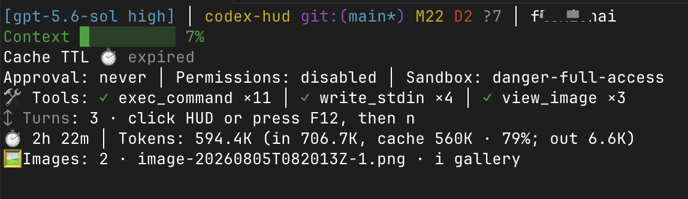
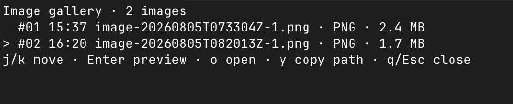
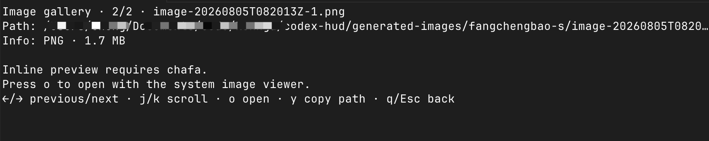

# Image viewer

The image viewer turns image paths recorded in the active Codex rollout into a session-scoped terminal gallery. It is an optional layer on top of the persistent HUD and does not upload, copy, or modify image files.

## Image sources

The gallery collects existing local paths from the current root Codex session when they are emitted by:

- `view_image`
- image generation, creation, editing, or output tools

The parser keeps each path once and removes entries whose files are no longer available. A gallery belongs to the rollout bound to that HUD pane, so two Codex sessions in the same project keep separate image lists.

## Open the gallery

When at least one image is available, the compact HUD includes an `Images` row. Focus the HUD pane before using its keyboard controls, then press `i`.

| View             | Key                  | Action                                        |
| ---------------- | -------------------- | --------------------------------------------- |
| HUD              | `i`                  | Open the image gallery                        |
| List             | `j` / `k`, Up / Down | Select an image                               |
| List             | `Enter`, Right       | Open the inline preview                       |
| List or preview  | `o`                  | Open the selected file with the system viewer |
| List or preview  | `y`                  | Copy the selected path                        |
| Preview          | Left / Right         | Move to the previous or next image            |
| Preview          | `j` / `k`, Up / Down | Scroll the preview                            |
| Any gallery view | `Esc`                | Return or close                               |
| Any gallery view | `q`                  | Close immediately                             |

## Examples

The screenshots below use the same display width and preserve each terminal capture's aspect ratio so text remains sharp and readable.

<div align="center">
<figure>

<figcaption>The HUD shows the number of images and the <code>i gallery</code> entry point.</figcaption>
</figure>
<figure>

<figcaption>The gallery lists images from the current Codex session.</figcaption>
</figure>
<figure>

<figcaption>Without <code>chafa</code>, preview mode shows metadata and keeps the system-viewer action.</figcaption>
</figure>
</div>

## Inline preview

The viewer invokes [`chafa`](https://github.com/hpjansson/chafa) with a terminal-sized 256-color symbol rendering. It is an optional dependency:

```bash
# macOS
brew install chafa
```

If `chafa` is missing, cannot read the file, or times out, the viewer displays the path and file metadata and keeps the system-viewer action available through `o`.

## Platform behavior

`o` uses the platform default opener: `open` on macOS, `start` on Windows, and `xdg-open` on Linux. The HUD does not embed a GUI window inside cmux, tmux, or the native terminal.

## Privacy and limitations

- Image paths and previews remain local to the HUD process.
- The viewer does not transmit image bytes or create copies.
- The gallery only shows files still present on disk.
- The HUD pane must be focused before shortcuts can receive input.
- A renderer already running before an update must be restarted with a new Codex session to load the latest viewer code.

---

## 中文版：图片查看器

图片查看器会把当前 Codex rollout 中记录的本地图片路径转换成只属于当前会话的终端图片画廊。它是常驻 HUD 的可选功能，不会上传、复制或修改图片文件。

## 图片来源

查看器会从当前 root Codex 会话中收集仍存在的本地路径，来源包括：

- `view_image`
- 图片生成、创建、编辑或输出工具

同一个路径只保留一次；文件从磁盘删除后会从画廊中移除。画廊绑定到 HUD 当前绑定的 rollout，因此同一项目的不同 Codex 会话拥有各自独立的图片列表。

## 打开画廊

有可用图片时，紧凑 HUD 会显示 `Images` 行。先点击 HUD pane 使其获得焦点，再按 `i`。

| 视图         | 按键                     | 操作                       |
| ------------ | ------------------------ | -------------------------- |
| HUD          | `i`                      | 打开图片画廊               |
| 列表         | `j` / `k`、上 / 下方向键 | 选择图片                   |
| 列表         | `Enter`、右方向键        | 打开内联预览               |
| 列表或预览   | `o`                      | 使用系统默认查看器打开图片 |
| 列表或预览   | `y`                      | 复制图片路径               |
| 预览         | 左 / 右方向键            | 切换上一张或下一张         |
| 预览         | `j` / `k`、上 / 下方向键 | 滚动预览                   |
| 任意画廊视图 | `Esc`                    | 返回或关闭                 |
| 任意画廊视图 | `q`                      | 立即关闭                   |

## 示例

下面的截图统一使用相同展示宽度，并保持终端截图的原始比例，避免文字被拉伸。

<div align="center">
<figure>

<figcaption>HUD 显示图片数量和 <code>i gallery</code> 入口。</figcaption>
</figure>
<figure>

<figcaption>画廊列出当前 Codex 会话中的图片。</figcaption>
</figure>
<figure>

<figcaption>未安装 <code>chafa</code> 时，预览显示元信息，并保留系统查看器入口。</figcaption>
</figure>
</div>

## 内联预览

查看器通过 [`chafa`](https://github.com/hpjansson/chafa) 生成适合终端尺寸的 256 色字符预览。它是可选依赖：

```bash
# macOS
brew install chafa
```

如果没有安装 `chafa`、文件无法读取或转换超时，查看器会显示图片路径和文件元信息；仍可按 `o` 使用系统查看器打开图片。

## 平台行为

`o` 会调用平台默认打开命令：macOS 使用 `open`，Windows 使用 `start`，Linux 使用 `xdg-open`。HUD 不会把 GUI 窗口嵌入 cmux、tmux 或原生终端。

## 隐私与限制

- 图片路径和预览内容只留在本地 HUD 进程中。
- 查看器不会传输图片字节，也不会创建副本。
- 画廊只显示磁盘上仍存在的文件。
- 必须先聚焦 HUD pane，快捷键才能生效。
- 更新后已经运行的 renderer 不会热加载新版查看器，需要用新 Codex 会话重启。
